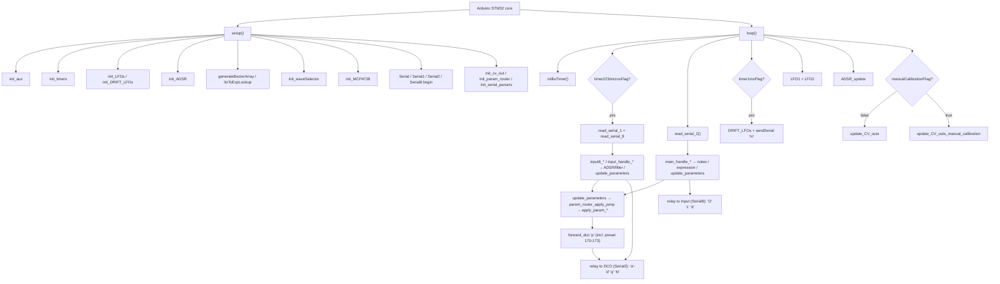

# DCO4_Mainboard_Controller File Index

Purpose of **every file**, and for each source function: **what it does**, **who calls it**, and **when**.

> `params_def.h`, `param_router.h`, `serial_input_protocol.h`,
> `serial_param_protocol.h`, `serial_frame.h` and `serial_parser.h` are no longer
> files in this folder. They come from the shared
> [`DCO-PROTOCOL`](../../DCO-PROTOCOL/README.md) library, symlinked in as
> `_build_libs/DCO-PROTOCOL`. Their entries below still describe the code this
> board compiles; edit them in the library, once, for every board.

- Deep narrative: [`REFERENCE_AI.md`](REFERENCE_AI.md)
- CV / pin map: [`CV_AND_PINS.md`](CV_AND_PINS.md)
- Modulation math: [`MODULATION_PIPELINE.md`](MODULATION_PIPELINE.md)
- Serial / ParamId how-to: [`README_serial_and_params.md`](README_serial_and_params.md)
- Preset relay contract: [`PRESET_RELAY.md`](PRESET_RELAY.md)
- Four-board topology: [`SYSTEM_OVERVIEW.md`](SYSTEM_OVERVIEW.md) → DCO `docs/SYSTEM_OVERVIEW.md`
- Reintegration: [`MAINBOARD_REINTEGRATION.md`](MAINBOARD_REINTEGRATION.md)
- Repo entry / doc index: [`../README.md`](../README.md)

Headers with no bodies are marked **no function definitions**.  
**Dead** = no live callers. **Unreachable** = call site exists but cannot run as currently gated. **`#ifdef` gated** = compiled only when the flag is set. **commented-out** = body fully commented (not compiled).

MCU: **STM32** (single Arduino core). Analog/modulation hub: Q15 ADSRs/LFOs/matrix, filter/VCA CVs (hardware timers + MCP4728), wave select, slim LE param routing between DCO / Input / Screen, and the per-command-byte preset relay carrying Input ↔ DCO traffic.

---

## Call-flow overview

| Context tag | Meaning |
|-------------|---------|
| Framework | Arduino invokes `setup` / `loop` |
| Boot | Inside `setup()` once |
| Every `loop` | Realtime forever loop |
| Soft timer | Gated by `millisTimer()` flags (`timer223microsFlag`, `timer1msFlag`, `timer99microsFlag`, …) |
| Serial2 (DCO) | Parser command on DCO link (`read_serial_2`) |
| Serial8 (Input) | Parser command on input link (`read_serial_8`) |
| Serial1 (Screen) | Screen UART; RX stub today, TX used by some sends |
| Param table | Only via `paramTable[]` / `param_router_apply` / `update_parameters` |
| Hot path | `ADSR_update` / `update_CV_outs` / LFO every `loop` |
| Manual-cal | `manualCalibrationFlag` → `update_CV_outs_manual_calibration` |
| `#ifdef` | `ENABLE_SERIAL*`, `RUNNING_AVERAGE`, `ENABLE_SPI`, `ENABLE_SD`, `ENABLE_SCREEN` |

---

## 1. Entry / build / globals

### `DCO4_Mainboard_Controller.ino`

Main sketch: single-core `setup`/`loop`, UART bring-up, soft-timer scheduling, ADSR/LFO/PWM hot path.

**Functions**
- `setup()` — Init aux, hardware PWM timers, LFOs + drift LFOs, ADSR, `init_cv_out`, jump-table router, serial parsers, wave mux, MCP4728; open Serial/1/2/8.
  - **Called from:** Arduino framework.
  - **When:** Boot once.
  - Notes: `initScreen` / `init_BU2505FV` / `initEEPROM` / `initAutotune` call sites are commented or `#ifdef`-gated off.
- `loop()` — Soft timers; ~223 µs Serial1+8; always Serial2; 1 ms drift + `'m'` TX; LFO1/2; ADSR; `update_CV_outs` (play vs manual-cal).
  - **Called from:** Arduino framework.
  - **When:** Forever.
- `print_mainboard_loop_timings()` — Print RunningAverage loop section averages to USB Serial.
  - **Called from:** `loop()` when `RUNNING_AVERAGE` **and** `timer500msFlag`.
  - **When:** `#ifdef RUNNING_AVERAGE` only (~2 Hz). Currently **enabled** in `MAINBOARD-CONTROLLER.ino`.

**Key macros / flags:** `ENABLE_SD` (on); `ENABLE_SPI` (commented); `RUNNING_AVERAGE` (enabled); Serial enables live in `Serial.h`.

### `include_all.h`

Umbrella include (also pulled oddly from inside `update_CV_outs()`). **No function definitions.**

### `build_opt.h`

Arduino build opts: larger Serial RX/TX buffers. **No function definitions.**

### `params.h`

Shared note/param globals (wave status, pot-manual flags, calibration flags, encoder-side vals, etc.), plus `presetName[16]` — a display/echo copy of the last `'q'` frame, not preset state. **No function definitions.**

### `params_def.h`

Canonical `enum ParamId` superset, byte-identical on every board of both projects (master: `DCO3-MONOSYNTH/DCO/params_def.h`). This board implements a subset; ids 170–173 are DCO preset / cal commands it only forwards. **No function definitions.**

---

## 2. Serial / parameters

### `Serial.h`

UART instances + enable macros (`ENABLE_SERIAL`, `ENABLE_SERIAL1`, `ENABLE_SERIAL2`, `ENABLE_SERIAL8`), RX/TX pin defines, TX prototypes, and `SERIAL_INNER_MAX_PAYLOAD 17` — set before `serial_frame.h` is included, sized by the relayed `'O'` frame. **No function definitions.**

### `Serial.ino`

Inbound parsers: Serial1 (stub), Serial2 (DCO), Serial8 (Input). Also holds both relay tables — `mainSerial2Commands[]` (DCO → Input) and `inputSerial8Commands[]` (Input → DCO). A command byte absent from them is dropped silently; see [`PRESET_RELAY.md`](PRESET_RELAY.md).

**Functions**
- `read_serial_1()` — Read and discard whatever Screen sends; no parser on this port.
  - **Called from:** `loop()` when `timer223microsFlag`.
  - **When:** Soft timer; body under `#ifdef ENABLE_SERIAL1` (enabled).
- `main_handle_note_on()` — Apply voice velocity/note; set `noteStart`/`noteEnd`.
  - **Called from:** Serial2 command table via `serial_parser_process_byte`.
  - **When:** DCO `'n'` frame.
- `main_handle_note_off()` — Set `noteEnd` / clear `noteStart`.
  - **Called from:** Serial2 parser.
  - **When:** DCO `'o'` frame.
- `main_handle_param16()` — `decode_param_p` → `update_parameters`, then mirror to Input with `serialSendParam16ToInput` (every id except `PARAM_DEBUG_COMMAND`). This is the path a preset recall's persistable params take to the panel.
  - **Called from:** Serial2 parser.
  - **When:** DCO `'p'`.
- `main_handle_expression()` — Aftertouch / mod wheel / pitch bend into the mod matrix sources.
  - **Called from:** Serial2 parser.
  - **When:** DCO `'e'`.
- `main_handle_param32()` — `decode_param_x` → `update_parameters`.
  - **Called from:** Serial2 parser.
  - **When:** DCO `'x'`.
- `read_serial_2()` — `serial_parser_drain` on Serial2, with a `mb_filter_forward_ring_drain()` either side.
  - **Called from:** `loop()` every iteration.
  - **When:** Every `loop`; body under `#ifdef ENABLE_SERIAL2`.
- `input_handle_adsr1()` — Load EnvVCA A/D/S/R words; `mark_adsr_params_dirty` on change.
  - **Called from:** Serial2 parser (USB/MIDI mirror); `input8_handle_adsr1()`.
  - **When:** DCO `'a'` or Input `'a'`.
- `input_handle_adsr2()` — Load EnvVCF A/D/S/R.
  - **Called from:** Serial2 parser (USB/MIDI mirror); `input8_handle_adsr2()`.
  - **When:** DCO `'b'` or Input `'b'`.
- `input_handle_adsr3()` — Load EnvDCO A/D/S/R.
  - **Called from:** `input8_handle_adsr3()` only — `'c'` is **not** registered on Serial2.
  - **When:** Input `'c'`.
- `input_handle_filter_block()` — CUTOFF / RESONANCE / ADSR2toVCF / LFO2toVCF; scale bake. Apply only, no forwarding.
  - **Called from:** `main_handle_filter_block()` and `input8_handle_filter_block()`, never registered directly.
  - **When:** DCO `'d'` or Input `'d'`.
- `main_handle_filter_block()` — Apply via `input_handle_filter_block()`, then re-emit `'d'` on Serial8 so Input's pots follow a DCO-origin recall (parked in `mb_filter_forward_ring` when Serial8 is full).
  - **Called from:** Serial2 parser (USB/MIDI mirror, preset recall).
  - **When:** DCO `'d'` only — mirroring an Input-origin block would echo it back to its sender.
- `input_handle_param16()` — `decode_param_p` → `update_parameters` (PW=210, ADSR1→VCA=222).
  - **Called from:** Serial8 parser.
  - **When:** Input `'p'`.
- `input_handle_preset_name()` — Copy 16 chars into `presetName[]` (display/echo only) **and** forward the `'q'` frame to the DCO, which needs the name staged before the `PARAM_PRESET_SAVE` that follows.
  - **Called from:** Serial8 parser.
  - **When:** Input `'q'`.
- `input_handle_preset_dir_request()` — Relay `'N'` Input → DCO.
  - **Called from:** Serial8 parser.
  - **When:** Input asks for the preset directory (boot, browse-mode enter).
- `main_handle_preset_dir_entry()` — Relay `'O'` `[slot][name:16]` DCO → Input.
  - **Called from:** Serial2 parser.
  - **When:** Each of the 256 directory entries the DCO pushes.
- `main_handle_preset_loaded()` — Relay `'L'` `[slot]` DCO → Input.
  - **Called from:** Serial2 parser.
  - **When:** The DCO finished a load (boot recall, MIDI PC, `dco_control`, or Input).
- `mb_forward_block_to_dco()` — `serial_frame_write` of one block frame on Serial2.
  - **Called from:** the four `input8_*` wrappers.
  - **When:** Any Input-origin `'a'`–`'d'`.
- `input8_handle_adsr1()` / `input8_handle_adsr2()` / `input8_handle_adsr3()` / `input8_handle_filter_block()` — Call the plain local handler, then shadow the frame on the DCO so its preset records hold current envelope/filter values.
  - **Called from:** Serial8 parser (these, not the plain handlers, are what `inputSerial8Commands[]` registers).
  - **When:** Input `'a'` / `'b'` / `'c'` / `'d'`.
- `mb_filter_forward_ring_enqueue()` / `mb_filter_forward_ring_drain()` — 8-deep backlog for `'d'` frames when Serial8 has no TX room.
  - **Called from:** `main_handle_filter_block()`; `read_serial_2()` (drain, before and after the parse).
  - **When:** Serial8 congestion only.
- `read_serial_8()` — `serial_parser_drain` on Serial8.
  - **Called from:** `loop()` when `timer223microsFlag`, or opportunistically when `Serial8.available()`.
  - **When:** Soft timer; body under `#ifdef ENABLE_SERIAL8`.
- `init_serial_parsers()` — Reset both contexts and build the two 256-entry LUTs from `mainSerial2Commands[]` / `inputSerial8Commands[]`.
  - **Called from:** `setup()`.
  - **When:** Boot. **Adding a relayed command means adding a row to one of those two arrays.**

### `Serial2.ino`

Outbound frames to DCO / Screen / Input.

**Functions**
- `serial_send_mod_stream()` / `sendSerial()` — TX `'m'` (LFO1/2 Q15 + EnvDCO Q15×4 + matrix pitch Q24); body only under `ENABLE_MB_MOD_STREAM`.
  - **Called from:** `loop()` when `timer1msFlag`.
  - **When:** Soft timer ~1 ms.
- `serialSendParamToDCO(uint8_t, int16_t)` — `'p'` to DCO. The relay primitive behind `forward_dco`, including preset / cal ids 170–173.
  - **Called from:** `forward_dco()` in `params.ino`.
  - **When:** Param table forwards.
- `serialSendParam32ToDCO(uint8_t, uint32_t)` — `'x'` to DCO.
  - **Called from:** **none (dead)**.
- `serialSendParam32ToScreen(uint8_t, uint32_t)` — `'x'` to Screen (Serial1).
  - **Called from:** `main_handle_param32()` for gap 154.
  - **When:** DCO `'x'`.
- `serialSendParam32ToInput(uint8_t, uint32_t)` — `'x'` to Input (Serial8).
  - **Called from:** `main_handle_param32()` for gap 154 / cal 155.
  - **When:** DCO `'x'`.
- `serialSendParam16ToInput(uint8_t, int16_t)` — `'p'` persistable mirror to Input.
  - **Called from:** `main_handle_param16()`, for every id except `PARAM_DEBUG_COMMAND`.
  - **When:** DCO `'p'` — this is how a preset recall reaches the panel.
- `serial_send_bench_text_on(Stream&, …)` / `serial_send_bench_text_chunk()` — `'t'` ASCII chunk.
  - **Called from:** `bench.h` dumps; `mb_uart_probe_poll()`.
  - **When:** Bench dump / `MB_UART_PROBE`.
- `mb_uart_probe_poll()` — 1 Hz `'t'` labels on every UART.
  - **Called from:** `loop()` when `timer1msFlag`; no-op inline unless `MB_UART_PROBE`.

### `param_router.h`

**Functions**
- `param_router_build_jump()` — Expand `ParamDescriptorT` table into the 256-entry jump array.
  - **Called from:** `init_param_router()`.
  - **When:** Boot.
- `param_router_apply_jump()` — O(1) dispatch; unknown ids are ignored.
  - **Called from:** `update_parameters()`.
  - **When:** Any decoded param frame.

### `params.ino`

Central param router (`int16_t` values) and the 256-entry apply jump table.

**Functions**
- `init_param_router()` — Build `paramApplyJump[]` from `paramTable[]`.
  - **Called from:** `setup()`.
  - **When:** Boot.
- `update_parameters(uint16_t, int16_t)` — Entry → `param_router_apply_jump`.
  - **Called from:** `main_handle_param16` / `main_handle_param32`; `input_handle_param16`.
  - **When:** Serial2 or Serial8 param frames.
- `forward_dco(id, v)` — `serialSendParamToDCO`; the single relay primitive used by every forwarding applier.
  - **Called from:** `apply_param_*` below.
- All `apply_param_*()` below — **Called from:** **param table only** (never direct). **When:** matching ParamId.

| Function | What it does |
|----------|----------------|
| `apply_param_osc1_saw_enable` | `osc1SawEnable` + `update_waveSelector(0)` |
| `apply_param_osc1_pulse_enable` | `osc1PulseEnable` (no mux write) |
| `apply_param_osc1_tri_enable` | `osc1TriEnable` + `update_waveSelector(2)` |
| `apply_param_osc2_saw_enable` | `osc2SawEnable` + `update_waveSelector(0)` |
| `apply_param_osc2_pulse_enable` | `osc2PulseEnable` + `update_waveSelector(3)` |
| `apply_param_osc2_tri_enable` | `osc2TriEnable` + `update_waveSelector(3)` |
| `apply_param_osc3_saw/pulse/tri_enable` | **No-op** — no OSC3 on 4×2 analog |
| `apply_param_sine_status` | `sineStatus` only |
| `apply_param_resonance_comp` | `RESONANCEAmpCompensation` |
| `apply_param_vca_adsr_restart` | `VCAADSRRestart` + `ADSR_VCA_set_restart` |
| `apply_param_vcf_adsr_restart` | `VCFADSRRestart` + `ADSR_VCF_set_restart` |
| `apply_param_adsr3_to_osc_select` | Local + forward DCO |
| `apply_param_lfo1_waveform` / `apply_param_lfo2_waveform` | Local LFO wave + re-seed Mode0 freq |
| `apply_param_osc1_interval` / `apply_param_osc2_interval` | Local + forward DCO |
| `apply_param_osc3_interval` | Forward-only to DCO |
| `apply_param_osc2_detune` | Local + forward DCO |
| `apply_param_osc3_detune` | Forward-only to DCO |
| `apply_param_lfo2_to_osc2` / `_osc3` / `_osc2_coarse` / `_osc3_coarse` | Forward-only to DCO |
| `apply_param_character` | Forward-only to DCO |
| `apply_param_osc_sync_mode` | Local + forward DCO |
| `apply_param_portamento_time` / `apply_param_portamento_mode` | Local + forward DCO |
| `apply_param_vcf_keytrack` | `VCFKeytrack` + `VCFKeytrackModifier_q15` bake |
| `apply_param_velocity_to_vcf` | Velocity→VCF Q15 scale |
| `apply_param_velocity_to_vca` | Velocity→VCA Q15 scale |
| `apply_param_osc1_level` / `apply_param_osc2_level` | `lin_to_log_128` map + `mcpUpdate` |
| `apply_param_osc3_level` | Stores `OSC3LevelVal`; no analog destination |
| `apply_param_sub_level` | Scale ×32 + `mcpUpdate` |
| `apply_param_calibration_value` | **No-op** (compat) |
| `apply_param_voice_mode` | Local + forward DCO |
| `apply_param_unison_detune` | Local + forward DCO |
| `apply_param_analog_drift_amount` | Local + forward DCO |
| `apply_param_analog_drift_speed` | Local + forward DCO |
| `apply_param_analog_drift_spread` | Local + forward DCO |
| `apply_param_sync_mode` / `apply_param_soft_sync` / `apply_param_subosc_divide` | Forward-only to DCO |
| `apply_param_lfo1_to_dco` | Q24 pitch-depth bake + forward DCO |
| `apply_param_lfo1_to_osc1` / `_osc2` / `_osc3` | Forward-only to DCO |
| `apply_param_lfo1_speed` / `apply_param_lfo2_speed` | `expConverterFloat` + `setMode0Freq` |
| `apply_param_vca_level` | Scale ×32 → `VCALevel` |
| `apply_param_lfo1_to_vca` | Clamp + `cv_bake_lfo1_to_vca_scale` |
| `apply_param_dist_drive` / `apply_param_dist_mix` / `apply_param_filter_mode` | Clamp into the CV globals |
| `apply_param_lfo2_to_pw` | Local + forward DCO |
| `apply_param_adsr3_to_pwm` | Offset −512 + forward DCO |
| `apply_param_adsr3_to_detune1` / `apply_param_adsr3_pitch_mode` | Local + forward DCO |
| `apply_param_adsr1_attack_curve` / `_decay_curve` | → `ADSR_VCA_change_*_curve` |
| `apply_param_adsr2_attack_curve` / `_decay_curve` | → `ADSR_VCF_change_*_curve` |
| `apply_param_mod_slotN_source` / `_dest` / `_depth` (N = 0..7) | `mod_matrix_set_*`; generated by `DECL_MOD_SLOT_APPLIERS` |
| `apply_param_pw_value` | Local + forward DCO |
| `apply_param_adsr1_to_vca` | `ADSR1toVCA` |
| `apply_param_pwm_pots_manual` | Flag + forward DCO |
| `apply_param_adsr3_enabled` | `ADSR3Enabled` |
| `apply_param_function_key` | **No-op** |
| `apply_param_calibration_flag` | Flag + forward DCO |
| `apply_param_manual_calibration_flag` | Manual + cal flags + forward DCO |
| `apply_param_manual_calibration_stage` | Stage + forward DCO |
| `apply_param_manual_calibration_offset` | Forward DCO only |
| `apply_param_gap_from_dco` | **No-op** — the `'x'` fan-out to Input/Screen happens in `main_handle_param32` |
| `apply_param_manual_calibration_offset_from_dco` | **No-op** — same, forwarded to Input by `main_handle_param32` |
| `apply_param_manual_calibration_store` | Forward store edge to DCO |
| `apply_param_preset_save` (170) / `apply_param_preset_load` (171) / `apply_param_preset_dump` (172) / `apply_param_cal_dump` (173) | Pure `forward_dco` — the DCO owns the preset store, this board keeps no preset state. See [`PRESET_RELAY.md`](PRESET_RELAY.md) |
| `apply_param_debug_command` | 40/41/42 → local `bench_*`; anything else forwarded to DCO |

### `serial_parser.h`

Generic non-blocking frame parser.

**Functions**
- `serial_parser_reset()` — Clear context to wait-for-cmd.
  - **Called from:** `serial_parser_check_timeout`; `serial_parser_process_byte`.
  - **When:** Timeout or frame complete.
- `serial_command_table_init()` — Fill a 256-entry `SerialCommandTable` LUT from a `SerialCommandDef[]`; unlisted bytes keep `payload_len == 0`.
  - **Called from:** `init_serial_parsers()`.
  - **When:** Boot.
- `serial_parser_check_timeout()` — Drop stale partial frames.
  - **Called from:** `serial_parser_drain`.
  - **When:** Stream idle mid-frame.
- `serial_parser_dispatch()` — Invoke `on_frame` if the LUT length matches. **An unregistered command byte, or a length mismatch, returns here silently** — this is where an unrelayed preset frame disappears.
  - **Called from:** `serial_parser_process_byte`.
  - **When:** Frame complete.
- `serial_parser_process_byte()` — RAW / COBS state machine.
  - **Called from:** `serial_parser_drain`.
  - **When:** Each RX byte.
- `serial_parser_drain()` — Read up to `SERIAL_DRAIN_BYTE_BUDGET` (64) bytes per call.
  - **Called from:** `read_serial_2`; `read_serial_8`.
  - **When:** Every `loop` / soft timer.

### `serial_param_protocol.h`

**Functions**
- `decode_i16_be()` — Big-endian int16.
  - **Called from:** `decode_param_p`.
- `decode_i32_le()` — Little-endian int32.
  - **Called from:** `decode_param_x`.
- `decode_param_p()` / `decode_param_w()` / `decode_param_x()` — Fill `ParamFrame`.
  - **Called from:** Serial handlers in `Serial.ino`.
  - **When:** Param frames.

### `serial_protocol.h`

Mainboard↔DCO command enums / payload lengths (`'n'`, `'o'`, `'e'`, `'m'`, `'t'`, `'p'`, `'x'`).

**Functions**
- `serial_protocol_payload_len(uint8_t)` — Map cmd → size.
  - **Called from:** **none (dead)** — tables use constexpr lengths directly.

### `serial_input_protocol.h`

Input ↔ DCO command superset: `'a'`–`'d'`, `'p'`, 16-char `'q'`, `'x'`, `'B'`/`'C'` bulk, and the `'N'`/`'O'`/`'L'` preset directory frames. **Byte-identical to the master copy** at `DCO3-MONOSYNTH/DCO/serial_input_protocol.h`; this board implements or relays a subset (`'B'`/`'C'` are host→DCO over USB only).

**Functions**
- `serial_input_payload_len(uint8_t)` — Map cmd → size.
  - **Called from:** **none (dead)** — tables use constexpr lengths directly.

### `serial_frame.h`

RAW / COBS framing codec around the inner `[cmd][payload]` frame. Its default `SERIAL_INNER_MAX_PAYLOAD` of 8 is overridden to **17** by `Serial.h` before inclusion; `serial_frame_stuff()` refuses any payload above that, so the cap has to be raised before a longer frame can be relayed.

**Functions**
- `serial_frame_write()` — Stuff + write one inner frame to a stream. Every relay handler ends here.
  - **Called from:** `Serial.ino` relay handlers; `Serial2.ino` senders.
  - **When:** Any TX.
- `serial_frame_stuff()` / `serial_frame_unstuff()` / `serial_cobs_encode()` / `serial_cobs_decode()` / `serial_inner_pack()` / `serial_inner_unpack()` — Framing helpers.
  - **Called from:** `serial_frame_write`; `serial_parser.h`.

---

## 3. Modulation / CV path

### `ADSR.h`

ADSR globals, Bézier `adsr` instances, `ADSRVoices[]`. Prototypes implied by `.ino`. **No function definitions.**

### `ADSR.ino`

**Functions**
- `init_ADSR()` — Init Bézier tables; set A/D/S/R + restart for all voices’ ADSR1/2/3.
  - **Called from:** `setup()`.
  - **When:** Boot.
- `ADSR_update()` — Per-voice noteOff/noteOn from `noteEnd`/`noteStart`; sample levels; call `ADSR_set_parameters`.
  - **Called from:** `loop()` every iteration.
  - **When:** Hot path.
- `ADSR_set_parameters()` — Throttled (~5 ms) sustain refresh.
  - **Called from:** `ADSR_update()`.
  - **When:** Hot path (time-gated).
- `ADSR1_set_restart()` — Apply `VCAADSRRestart` to all ADSR1.
  - **Called from:** `apply_param_vca_adsr_restart()`.
  - **When:** Param table.
- `ADSR2_set_restart()` — Apply `VCFADSRRestart` to all ADSR2.
  - **Called from:** `apply_param_vcf_adsr_restart()`.
  - **When:** Param table.
- `ADSR1_change_attack_curve()` / `ADSR1_change_decay_curve()` — Set curves + re-apply ADSR1 params.
  - **Called from:** matching `apply_param_adsr1_*_curve`.
  - **When:** Param table.
- `ADSR1_change_release_curve()` — Same for release.
  - **Called from:** **none (dead)**.
- `ADSR2_change_attack_curve()` / `ADSR2_change_decay_curve()` — ADSR2 curves.
  - **Called from:** matching `apply_param_adsr2_*_curve`.
  - **When:** Param table.
- `ADSR2_change_release_curve()` — ADSR2 release curve.
  - **Called from:** **none (dead)**.

### `LFO.h`

LFO classes, drift LFOs, modulation globals. Declares `LFO3()` but **no definition exists**. **No function definitions** (declarations only).

### `LFO.ino`

**Functions**
- `init_LFOs()` — `init_LFO1` + `init_LFO2`.
  - **Called from:** `setup()`.
  - **When:** Boot.
- `init_DRIFT_LFOs()` — Per-voice `init_DRIFT_LFO`.
  - **Called from:** `setup()`.
  - **When:** Boot.
- `init_DRIFT_LFO()` — Configure one drift LFO wave/amp/freq with voice offset.
  - **Called from:** `init_DRIFT_LFOs()`.
  - **When:** Boot.
- `init_LFO1()` / `init_LFO2()` — Default wave/amp/freq.
  - **Called from:** `init_LFOs()`.
  - **When:** Boot.
- `LFO1()` — Sample bipolar LFO1 level.
  - **Called from:** `loop()` every iteration.
  - **When:** Hot path.
- `LFO2()` — Sample bipolar LFO2 level.
  - **Called from:** `loop()` every iteration.
  - **When:** Hot path.
- `DRIFT_LFOs()` — Sample drift LFOs; compute `VCF_DRIFT[]` from `analogDrift`.
  - **Called from:** `loop()` when `timer1msFlag`.
  - **When:** Soft timer ~1 ms.
- `LFO3()` — Declared in `LFO.h`; **not defined** → **Dead / missing**.

### `PWM.h`

`VCF_PWM` / `VCA_PWM` / level PWM globals. **No function definitions.**

### `PWM.ino`

**Functions**
- `mcpUpdate()` — Push SQR1/SQR2/Sub levels to three MCP4728 chips.
  - **Called from:** `apply_param_osc1_level` / `_osc2_level` / `_sub_level`; `update_CV_outs` / `update_CV_outs_manual_calibration`.
  - **When:** Param / CV tick / manual-cal.

### `cv_out.ino`

**Functions**
- `update_CV_outs()` — Q15 VCA/VCF/reso math + matrix; write hardware timer compare registers.
  - **Called from:** `loop()` when `manualCalibrationFlag == false`.
  - **When:** Hot path (play).
- `update_CV_outs_manual_calibration()` — Mute mux / park VCA / force SQR for current cal stage.
  - **Called from:** `loop()` when `manualCalibrationFlag == true`.
  - **When:** Manual-cal hot path.

### `waveSelector.h`

74HC595 mux pins / pin arrays; includes the vendored `_build_libs/RoxMux_fela/src/RoxMux_fela.h`. **No function definitions.**

### `waveSelector.ino`

**Functions**
- `init_waveSelector()` — GPIO + RoxMux begin / allOff.
  - **Called from:** `setup()`.
  - **When:** Boot.
- `update_waveSelector(byte)` — Per-wave or all (case 4) pin writes + `update()`.
  - **Called from:** `apply_param_osc1_saw_enable` / `_osc1_tri_enable` / `_osc2_saw_enable` / `_osc2_pulse_enable` / `_osc2_tri_enable` (cases 0, 2, 3). Case 4 has no live caller.
  - **When:** Param table.

### `MCP4728.ino`

**Functions**
- `init_MCP4728()` — Wire @ 1 MHz; attach three MCP4728; write 4095 to all channels.
  - **Called from:** `setup()`.
  - **When:** Boot.

### `tables.h`

`lin_to_log_128`, `linToExpLookup`, `AS2164_VCA_linearize_table`. **No function definitions.**

---

## 4. Timing / utilities

### `Timers.h`

HardwareTimer objects + PWM pin macros. **No function definitions.**

### `Timers.ino`

**Functions**
- `init_timers()` — Configure TIM1/2/3/4/5/8/12/13/15 PWM modes, overflow `ADSR_1_DACSIZE`, resume. Some channels skipped when `ENABLE_SPI` / `ENABLE_SD`.
  - **Called from:** `setup()`.
  - **When:** Boot. (`ENABLE_SD` is defined → TIM8 CH4 path restricted.)

### `Timers_millis.h`

Soft-timer timestamps + flags. **No function definitions.**

### `Timers_millis.ino`

**Functions**
- `millisTimer()` — Clear then set soft flags (50 µs … 500 ms).
  - **Called from:** `loop()` every iteration.
  - **When:** Every `loop`.

### `auxiliary.h`

**Functions** (inline in header)
- `mapFloat()` — Float map.
  - **Called from:** **none (dead)**.
- `bezierCubic()` — Cubic Bézier point.
  - **Called from:** `findYForX()`.
  - **When:** Boot table build.
- `findYForX()` — Binary search y for x on Bézier.
  - **Called from:** `generateBezierArray()`.
  - **When:** Boot.
- `generateBezierArray()` — Fill 4096-entry VCA linearize table.
  - **Called from:** `setup()`.
  - **When:** Boot.
- `linearToExponential()` — Lin→exp for ADSR fader table.
  - **Called from:** `setup()` loop filling `linToExpLookup`.
  - **When:** Boot.
- Commented: `isin` / `delayCycles` — **commented-out**.

### `auxiliary.ino`

**Functions**
- `init_aux()` — Empty body.
  - **Called from:** `setup()`.
  - **When:** Boot (no-op).
- `faderExpConverter()` — Cubic-ish fader curve.
  - **Called from:** **none (dead)**.
- `expConverterFloat()` — Squared float curve.
  - **Called from:** `controls_formula_update` cases 1–3.
  - **When:** Boot / LFO speed params.
- `expConverter()` — Squared uint16 curve.
  - **Called from:** `controls_formula_update` cases 4, 31.
  - **When:** Boot (case 4); case 31 dead.
- `expConverterReverse()` / `expConverterFloatReverse()` — Sqrt inverse.
  - **Called from:** **none (dead)**.

### `noteList.h`

MIDI note frequency `#define`s. **No function definitions.** (Not included by current main sketch.)

### `SPI_settings.h`

SPI settings stub; body commented. **No active function definitions.** Included only if `ENABLE_SPI` (currently off).

---

## 5. Disabled / deleted

### `flashData.h` / `flashData.ino` — **deleted**

The board's former SD/EEPROM preset I/O (`initEEPROM`, `loadPreset`, `writePreset`, `load_preset_name`, `get_preset_name`) is gone, not commented. No preset is stored or unpacked here: the DCO owns the instrument's 256-slot LittleFS store and this board only relays preset traffic ([`PRESET_RELAY.md`](PRESET_RELAY.md)). `ENABLE_SD` now only reserves the SDMMC pins for `init_timers()`.

### `formulas.h` / `formulas.ino` — **deleted**

Float-era formula scalars; depths bake in `cv_out.ino` / `params.ino`.

### `BU2505FV.ino`

`#ifdef ENABLE_SPI` wrapper; **both functions fully commented**. `ENABLE_SPI` is **not** defined → file contributes nothing.

| Commented function | Former role |
|--------------------|-------------|
| `init_BU2505FV()` | SPI + LD pin |
| `BU2505FV_set_channel()` | 10-bit SPI DAC write |

`setup` call `init_BU2505FV()` is commented inside `#ifdef ENABLE_SPI`.

---

## 6. Documentation

All detailed docs live under `docs/` (this file included). Root `README.md` is the repo entry point.

| File | Status | Purpose |
|------|--------|---------|
| `README.md` (repo root) | Current | Overview / build / doc index. |
| `docs/SYSTEM_OVERVIEW.md` | Current | Stub pointing to DCO4_DCO canonical overview (+ local UART table). |
| `docs/MODULATION_PIPELINE.md` | Current | ADSR/LFO → VCA/VCF/PW math. |
| `docs/CV_AND_PINS.md` | Current | Timer / DAC / mux pin map. |
| `docs/REFERENCE_AI.md` | Current | Deep semantic map. |
| `docs/FILE_INDEX.md` | Current | This file — files, functions, call sites. |
| `docs/README_serial_and_params.md` | Current | Shared serial / ParamId how-to. |
| `docs/MAINBOARD_REINTEGRATION.md` | Current | UART topology, ownership, per-link frame tables. |
| `docs/PRESET_RELAY.md` | Current | Preset traffic Input ↔ DCO across this board. |

---

## 7. External libraries (not in this repo)

| Library | Used by | Status |
|---------|---------|--------|
| `ADSR_Bezier` | `ADSR.*` | Active |
| `mo-lfo` | `LFO.*` | Active |
| `MCP4728_multiaddress` | `MCP4728.ino` | Active |
| `RoxMux_fela` (74HC595) | `waveSelector.*` | Active; vendored under `_build_libs/RoxMux_fela` |
| `Wire` | `MCP4728.ino` | Active |
| `RunningAverage` | `bench.h` | Active via `RUNNING_AVERAGE` in `MAINBOARD-CONTROLLER.ino` |
| `STM32SD` / `EEPROM` | — | Unused; `flashData.*` deleted, no preset store on this board |
| `SPI` | `SPI_settings.h` / `BU2505FV.ino` | Inactive; `ENABLE_SPI` undefined, include commented |
| `Adafruit_MCP4728` | `MCP4728.ino` | Inactive; include commented |

---

## Quick “where do I change X?”

| Goal | Start here |
|------|------------|
| New ParamId | Master `params_def.h`, copied out → `apply_param_*` + `paramTable[]` in `params.ino` |
| Serial2 (DCO) RX command | `serial_protocol.h` + handler in `Serial.ino` `mainSerial2Commands[]` |
| Serial8 (Input) RX command | `serial_input_protocol.h` + handler in `Serial.ino` `inputSerial8Commands[]` |
| Forward param to DCO | `forward_dco()` from an `apply_param_*` |
| Relay a frame Input ↔ DCO | Handler + row in the matching table above; raise `SERIAL_INNER_MAX_PAYLOAD` if over 17. [`PRESET_RELAY.md`](PRESET_RELAY.md) |
| VCA / VCF CV math | `cv_out.ino` `update_CV_outs()` (Q15 bakers) |
| ADSR timing / curves | `ADSR.ino`; curves via params 48–51 |
| LFO rate / shape | `LFO.ino` + `apply_param_lfo*_speed/waveform` |
| Wave select (analog mux) | `waveSelector.ino` / `apply_param_*_status` |
| SQR/Sub DAC levels | `mcpUpdate()` + `apply_param_sqr*_level` / `sub_level` |
| Soft timer rates | `Timers_millis.ino` |
| Hardware PWM pins | `Timers.h` + `init_timers()` |
| Manual calibration CV path | `apply_param_manual_calibration_*` → `update_CV_outs_manual_calibration` |
| Loop profiling | Define `RUNNING_AVERAGE` → `print_mainboard_loop_timings` |
| Preset load/save | Not implemented here — DCO `preset_store.*`; this board only relays ([`PRESET_RELAY.md`](PRESET_RELAY.md)) |