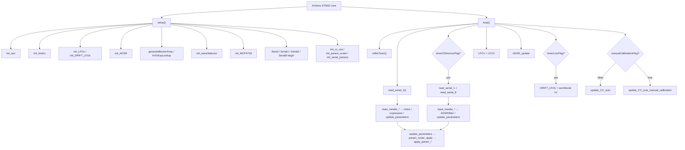

# DCO4_Mainboard_Controller File Index

Purpose of **every file**, and for each source function: **what it does**, **who calls it**, and **when**.

- Deep narrative: [`REFERENCE_AI.md`](REFERENCE_AI.md)
- CV / pin map: [`CV_AND_PINS.md`](CV_AND_PINS.md)
- Modulation math: [`MODULATION_PIPELINE.md`](MODULATION_PIPELINE.md)
- Serial / ParamId how-to: [`README_serial_and_params.md`](README_serial_and_params.md)
- Four-board topology: [`SYSTEM_OVERVIEW.md`](SYSTEM_OVERVIEW.md) → DCO `docs/SYSTEM_OVERVIEW.md`
- Reintegration: [`MAINBOARD_REINTEGRATION.md`](MAINBOARD_REINTEGRATION.md)
- Repo entry / doc index: [`../README.md`](../README.md)

Headers with no bodies are marked **no function definitions**.  
**Dead** = no live callers. **Unreachable** = call site exists but cannot run as currently gated. **`#ifdef` gated** = compiled only when the flag is set. **commented-out** = body fully commented (not compiled).

MCU: **STM32** (single Arduino core). Analog/modulation hub: Q15 ADSRs/LFOs/matrix, filter/VCA CVs (hardware timers + MCP4728), wave select, slim LE param routing between DCO / Input / Screen.

---

## Call-flow overview

| Context tag | Meaning |
|-------------|---------|
| Framework | Arduino invokes `setup` / `loop` |
| Boot | Inside `setup()` once |
| Every `loop` | Realtime forever loop |
| Soft timer | Gated by `millisTimer()` flags (`timer223microsFlag`, `timer1msFlag`, `timer99microsFlag`, …) |
| Serial2 (DCO) | Parser command on DCO link (`read_serial_2`) |
| Serial8 (Input) | Parser command on input link (`read_serial_8`) |
| Serial1 (Screen) | Screen UART; RX stub today, TX used by some sends |
| Param table | Only via `paramTable[]` / `param_router_apply` / `update_parameters` |
| Hot path | `ADSR_update` / `update_CV_outs` / LFO every `loop` |
| Manual-cal | `manualCalibrationFlag` → `update_CV_outs_manual_calibration` |
| `#ifdef` | `ENABLE_SERIAL*`, `RUNNING_AVERAGE`, `ENABLE_SPI`, `ENABLE_SD`, `ENABLE_SCREEN` |

---

## 1. Entry / build / globals

### `DCO4_Mainboard_Controller.ino`

Main sketch: single-core `setup`/`loop`, UART bring-up, soft-timer scheduling, ADSR/LFO/PWM hot path.

**Functions**
- `setup()` — Init aux, hardware PWM timers, LFOs + drift LFOs, ADSR, `init_cv_out`, jump-table router, serial parsers, wave mux, MCP4728; open Serial/1/2/8.
  - **Called from:** Arduino framework.
  - **When:** Boot once.
  - Notes: `initScreen` / `init_BU2505FV` / `initEEPROM` / `initAutotune` call sites are commented or `#ifdef`-gated off.
- `loop()` — Soft timers; ~223 µs Serial1+8; always Serial2; 1 ms drift + `'m'` TX; LFO1/2; ADSR; `update_CV_outs` (play vs manual-cal).
  - **Called from:** Arduino framework.
  - **When:** Forever.
- `print_mainboard_loop_timings()` — Print RunningAverage loop section averages to USB Serial.
  - **Called from:** `loop()` when `RUNNING_AVERAGE` **and** `timer500msFlag`.
  - **When:** `#ifdef RUNNING_AVERAGE` only (~2 Hz). Currently **gated off** (`RUNNING_AVERAGE` commented).

**Key macros / flags:** `ENABLE_SD` (on); `ENABLE_SPI` (commented); `RUNNING_AVERAGE` (commented); Serial enables live in `Serial.h`.

### `include_all.h`

Umbrella include (also pulled oddly from inside `update_CV_outs()`). **No function definitions.**

### `build_opt.h`

Arduino build opts: larger Serial RX/TX buffers. **No function definitions.**

### `params.h`

Shared note/param globals (wave status, pot-manual flags, calibration flags, encoder-side vals, etc.). **No function definitions.**

### `params_def.h`

Canonical `enum ParamId`. **No function definitions.**

---

## 2. Serial / parameters

### `Serial.h`

UART instances + enable macros (`ENABLE_SERIAL`, `ENABLE_SERIAL1`, `ENABLE_SERIAL2`, `ENABLE_SERIAL8`), finish byte, send flags, DCO param queues (`serialSendParamByteToDCOBuf`, `serialSendParamToDCOBuf`). **No function definitions.**

### `Serial.ino`

Inbound parsers: Serial1 (stub), Serial2 (DCO), Serial8 (Input).

**Functions**
- `read_serial_1()` — Drain Serial1; switch has only `default` (legacy preset cases commented).
  - **Called from:** `loop()` when `timer223microsFlag`.
  - **When:** Soft timer; body under `#ifdef ENABLE_SERIAL1` (enabled).
- `main_handle_note_on()` — Apply voice velocity/note; set `noteStart`/`noteEnd`.
  - **Called from:** Serial2 command table via `serial_parser_process_byte`.
  - **When:** DCO `'n'` frame.
- `main_handle_note_off()` — Set `noteEnd` / clear `noteStart`.
  - **Called from:** Serial2 parser.
  - **When:** DCO `'o'` frame.
- `main_handle_param16()` — `decode_param_p` → `update_parameters`.
  - **Called from:** Serial2 parser.
  - **When:** DCO `'p'`.
- `main_handle_param8()` — `decode_param_w` → `update_parameters`.
  - **Called from:** Serial2 parser.
  - **When:** DCO `'w'`.
- `main_handle_param32()` — `decode_param_x` → `update_parameters`.
  - **Called from:** Serial2 parser.
  - **When:** DCO `'x'`.
- `read_serial_2()` — Timeout + non-blocking Serial2 parser pump.
  - **Called from:** `loop()` every iteration.
  - **When:** Every `loop`; body under `#ifdef ENABLE_SERIAL2`.
- `input_handle_adsr1()` — Load ADSR1 A/D/S/R words.
  - **Called from:** Serial8 parser; Serial2 parser (USB/MIDI mirror).
  - **When:** Input `'a'` or DCO `'a'`.
- `input_handle_adsr2()` — Load ADSR2 A/D/S/R.
  - **Called from:** Serial8 parser; Serial2 parser (USB/MIDI mirror).
  - **When:** Input `'b'` or DCO `'b'`.
- `input_handle_adsr3()` — Load EnvDCO A/D/S/R.
  - **Called from:** Serial8 parser.
  - **When:** Input `'c'`.
- `input_handle_filter_block()` — CUTOFF / RESONANCE / ADSR2toVCF / LFO2toVCF; scale bake.
  - **Called from:** Serial8 parser; Serial2 parser (USB/MIDI mirror).
  - **When:** Input `'d'` or DCO `'d'`.
- `input_handle_param16()` — `decode_param_p` → `update_parameters` (PW=210, ADSR1→VCA=222).
  - **Called from:** Serial8 parser.
  - **When:** Input `'p'`.
- `input_handle_preset_name()` — Copy 8 chars into `presetName`.
  - **Called from:** Serial8 parser.
  - **When:** Input `'q'`.
- `read_serial_8()` — Timeout + non-blocking Serial8 parser pump.
  - **Called from:** `loop()` when `timer223microsFlag`.
  - **When:** Soft timer; body under `#ifdef ENABLE_SERIAL8`.

### `Serial2.ino`

Outbound frames to DCO / Screen / Input.

**Functions**
- `sendSerial()` — TX `'m'` mod stream (LFO1/2 Q15 + EnvDCO Q15×4 + matrix pitch Q24).
  - **Called from:** `loop()` when `timer1msFlag`.
  - **When:** Soft timer ~1 ms.
  - Note: `serialSendParamByteToDCOBuf` / `serialSendParamToDCOBuf` are **never written** anywhere → those two branches are effectively **Dead** (always empty).
- `serial_send_param_change(byte, uint16_t)` — Immediate `'p'` to Screen (Serial1).
  - **Called from:** **none (dead)** — only commented sites in `loop` / ParamId overload.
- `serialSendParam32ToDCO(byte, uint32_t)` — Blocking `'x'` to DCO.
  - **Called from:** **none (dead)** — only ParamId overload wrapper (also unused).
- `serialSendParam32ToScreen(byte, uint32_t)` — Blocking `'x'` to Screen.
  - **Called from:** ParamId overload ← `apply_param_gap_from_dco()`.
  - **When:** Param table (gap from DCO).
- `serialSendParam32ToInput(byte, uint32_t)` — Blocking `'x'` to Input (Serial8).
  - **Called from:** ParamId overload ← `apply_param_manual_calibration_offset_from_dco()`.
  - **When:** Param table.
- `serialSendParamByteToScreen(byte, byte)` — `'y'` frame to Screen.
  - **Called from:** **none (dead)** — only ParamId overload (unused).
- `serialSendParamByteToDCOFunction(byte, byte)` — Immediate `'w'` to DCO.
  - **Called from:** many `apply_param_*` in `params.ino`.
  - **When:** Param table forwards.
- `serialSendParamToDCOFunction(uint8_t, int)` — Immediate `'p'` to DCO.
  - **Called from:** several `apply_param_*` in `params.ino`.
  - **When:** Param table forwards.
- `serial_send_param_change(ParamId, …)` / `serialSendParam32ToDCO(ParamId, …)` / `serialSendParamByteToScreen(ParamId, …)` / `serialSendParamByteToDCO(ParamId, …)` / `serialSendParamToDCO(ParamId, …)` — Thin wrappers to byte APIs.
  - **Called from:** **none (dead)** except the Screen/Input 32-bit ParamId overloads used above (`serialSendParam32ToScreen` / `serialSendParam32ToInput`).

### `param_router.h`

**Functions**
- `param_router_apply<ValueT>()` — Linear search `ParamDescriptorT` table; invoke matching `apply`.
  - **Called from:** `update_parameters()`.
  - **When:** Any decoded param frame.

### `params.ino`

Central param router (`int32_t` values).

**Functions**
- `update_parameters(byte, int32_t)` — Entry → `param_router_apply` on `paramTable[]`.
  - **Called from:** `main_handle_param16/8/32`; `input_handle_param16/8`.
  - **When:** Serial2 or Serial8 param frames.
- All `apply_param_*()` below — **Called from:** **param table only** (never direct). **When:** matching ParamId.

| Function | What it does |
|----------|----------------|
| `apply_param_saw_status` | `sawStatus` + `update_waveSelector(0)` |
| `apply_param_saw2_status` | `saw2Status` + `update_waveSelector(1)` |
| `apply_param_tri_status` | `triStatus` + `update_waveSelector(2)` |
| `apply_param_sine_status` | `sineStatus` only (wave update commented historically) |
| `apply_param_sqr1_status` | `sqr1Status` + forward to DCO |
| `apply_param_sqr2_status` | `sqr2Status` + `update_waveSelector(3)` |
| `apply_param_resonance_comp` | `RESONANCEAmpCompensation` |
| `apply_param_vca_adsr_restart` | `VCAADSRRestart` + `ADSR1_set_restart` |
| `apply_param_vcf_adsr_restart` | `VCFADSRRestart` + `ADSR2_set_restart` |
| `apply_param_adsr3_to_osc_select` | Local + forward DCO |
| `apply_param_lfo1_waveform` | Local LFO1 wave + forward DCO |
| `apply_param_lfo2_waveform` | Local LFO2 wave + forward DCO |
| `apply_param_osc1_interval` | Local + forward DCO |
| `apply_param_osc2_interval` | Local + forward DCO |
| `apply_param_osc2_detune` | Local + forward DCO 16-bit |
| `apply_param_lfo2_to_detune2` | Local + forward DCO |
| `apply_param_osc_sync_mode` | Local + forward DCO |
| `apply_param_portamento_time` | Local + forward DCO |
| `apply_param_vcf_keytrack` | `VCFKeytrack` + `formula_update(1)` |
| `apply_param_velocity_to_vcf` | Velocity→VCF scale float |
| `apply_param_velocity_to_vca` | Velocity→VCA scale float |
| `apply_param_sqr1_level` | Log map + `mcpUpdate` |
| `apply_param_sqr2_level` | Log map + `mcpUpdate` |
| `apply_param_sub_level` | Scale + `mcpUpdate` |
| `apply_param_calibration_value` | **No-op** (compat) |
| `apply_param_voice_mode` | Local + forward DCO |
| `apply_param_unison_detune` | Local + forward DCO |
| `apply_param_analog_drift_amount` | Local + forward DCO |
| `apply_param_analog_drift_speed` | Local + forward DCO |
| `apply_param_analog_drift_spread` | Local + forward DCO |
| `apply_param_sync_mode` | Forward-only to DCO |
| `apply_param_lfo1_to_dco` | Local + forward DCO |
| `apply_param_lfo1_speed` | `controls_formula_update(1)` + forward |
| `apply_param_lfo2_speed` | `controls_formula_update(2)` + forward |
| `apply_param_vca_level` | Map 0..127 → `VCALevel` |
| `apply_param_lfo1_to_vca` | Local + `formula_update(7)` |
| `apply_param_lfo2_to_pw` | Local + forward DCO |
| `apply_param_adsr3_to_pwm` | Offset −512 + forward DCO |
| `apply_param_adsr3_to_detune1` | Local + forward DCO |
| `apply_param_adsr1_attack_curve` | → `ADSR1_change_attack_curve` |
| `apply_param_adsr1_decay_curve` | → `ADSR1_change_decay_curve` |
| `apply_param_adsr2_attack_curve` | → `ADSR2_change_attack_curve` |
| `apply_param_adsr2_decay_curve` | → `ADSR2_change_decay_curve` |
| `apply_param_pwm_pots_manual` | Flag + forward DCO |
| `apply_param_adsr3_enabled` | `ADSR3Enabled` |
| `apply_param_function_key` | **No-op** |
| `apply_param_calibration_flag` | Flag + forward DCO |
| `apply_param_manual_calibration_flag` | Manual + cal flags + forward DCO |
| `apply_param_manual_calibration_stage` | Stage + forward DCO |
| `apply_param_manual_calibration_offset` | Forward DCO only |
| `apply_param_gap_from_dco` | Forward 32-bit to Screen |
| `apply_param_manual_calibration_offset_from_dco` | Unpack + forward 32-bit to Input |
| `apply_param_manual_calibration_store` | Forward store edge to DCO |

### `serial_parser.h`

Generic non-blocking frame parser.

**Functions**
- `serial_parser_reset()` — Clear context to wait-for-cmd.
  - **Called from:** `serial_parser_check_timeout`; `serial_parser_process_byte`.
  - **When:** Timeout or frame complete.
- `serial_parser_find_cmd()` — Lookup command def.
  - **Called from:** `serial_parser_process_byte`.
  - **When:** First byte of frame.
- `serial_parser_check_timeout()` — Drop stale partial frames.
  - **Called from:** `read_serial_2`; `read_serial_8`.
  - **When:** Before draining UART if mid-payload.
- `serial_parser_process_byte()` — State machine; invoke `on_frame` when complete.
  - **Called from:** `read_serial_2`; `read_serial_8`.
  - **When:** Each RX byte.

### `serial_param_protocol.h`

**Functions**
- `decode_i16_be()` — Big-endian int16.
  - **Called from:** `decode_param_p`.
- `decode_i32_le()` — Little-endian int32.
  - **Called from:** `decode_param_x`.
- `decode_param_p()` / `decode_param_w()` / `decode_param_x()` — Fill `ParamFrame`.
  - **Called from:** Serial handlers in `Serial.ino`.
  - **When:** Param frames.

### `serial_protocol.h`

Mainboard↔DCO command enums / payload lengths.

**Functions**
- `serial_protocol_payload_len(char)` — Map cmd → size.
  - **Called from:** **none (dead)** — tables use constexpr lengths directly.

### `serial_input_protocol.h`

Input→mainboard command enums / sizes.

**Functions**
- `input_serial_payload_len(char)` — Map cmd → size.
  - **Called from:** **none (dead)** — tables use constexpr lengths directly.

---

## 3. Modulation / CV path

### `ADSR.h`

ADSR globals, Bézier `adsr` instances, `ADSRVoices[]`. Prototypes implied by `.ino`. **No function definitions.**

### `ADSR.ino`

**Functions**
- `init_ADSR()` — Init Bézier tables; set A/D/S/R + restart for all voices’ ADSR1/2/3.
  - **Called from:** `setup()`.
  - **When:** Boot.
- `ADSR_update()` — Per-voice noteOff/noteOn from `noteEnd`/`noteStart`; sample levels; call `ADSR_set_parameters`.
  - **Called from:** `loop()` every iteration.
  - **When:** Hot path.
- `ADSR_set_parameters()` — Throttled (~5 ms) sustain refresh.
  - **Called from:** `ADSR_update()`.
  - **When:** Hot path (time-gated).
- `ADSR1_set_restart()` — Apply `VCAADSRRestart` to all ADSR1.
  - **Called from:** `apply_param_vca_adsr_restart()`.
  - **When:** Param table. (Also only in commented `flashData` load.)
- `ADSR2_set_restart()` — Apply `VCFADSRRestart` to all ADSR2.
  - **Called from:** `apply_param_vcf_adsr_restart()`.
  - **When:** Param table.
- `ADSR1_change_attack_curve()` / `ADSR1_change_decay_curve()` — Set curves + re-apply ADSR1 params.
  - **Called from:** matching `apply_param_adsr1_*_curve`.
  - **When:** Param table.
- `ADSR1_change_release_curve()` — Same for release.
  - **Called from:** **none (dead)**.
- `ADSR2_change_attack_curve()` / `ADSR2_change_decay_curve()` — ADSR2 curves.
  - **Called from:** matching `apply_param_adsr2_*_curve`.
  - **When:** Param table.
- `ADSR2_change_release_curve()` — ADSR2 release curve.
  - **Called from:** **none (dead)**.

### `LFO.h`

LFO classes, drift LFOs, modulation globals. Declares `LFO3()` but **no definition exists**. **No function definitions** (declarations only).

### `LFO.ino`

**Functions**
- `init_LFOs()` — `init_LFO1` + `init_LFO2`.
  - **Called from:** `setup()`.
  - **When:** Boot.
- `init_DRIFT_LFOs()` — Per-voice `init_DRIFT_LFO`.
  - **Called from:** `setup()`.
  - **When:** Boot.
- `init_DRIFT_LFO()` — Configure one drift LFO wave/amp/freq with voice offset.
  - **Called from:** `init_DRIFT_LFOs()`.
  - **When:** Boot.
- `init_LFO1()` / `init_LFO2()` — Default wave/amp/freq.
  - **Called from:** `init_LFOs()`.
  - **When:** Boot.
- `LFO1()` — Sample bipolar LFO1 level.
  - **Called from:** `loop()` every iteration.
  - **When:** Hot path.
- `LFO2()` — Sample bipolar LFO2 level.
  - **Called from:** `loop()` every iteration.
  - **When:** Hot path.
- `DRIFT_LFOs()` — Sample drift LFOs; compute `VCF_DRIFT[]` from `analogDrift`.
  - **Called from:** `loop()` when `timer1msFlag`.
  - **When:** Soft timer ~1 ms.
- `LFO3()` — Declared in `LFO.h`; **not defined** → **Dead / missing**.

### `PWM.h`

`VCF_PWM` / `VCA_PWM` / level PWM globals. **No function definitions.**

### `PWM.ino`

**Functions**
- `mcpUpdate()` — Push SQR1/SQR2/Sub levels to three MCP4728 chips.
  - **Called from:** `apply_param_sqr1/sqr2/sub_level`; `update_CV_outs` / `update_CV_outs_manual_calibration`.
  - **When:** Param / CV tick / manual-cal.

### `cv_out.ino`

**Functions**
- `update_CV_outs()` — Q15 VCA/VCF/reso math + matrix; write hardware timer compare registers.
  - **Called from:** `loop()` when `manualCalibrationFlag == false`.
  - **When:** Hot path (play).
- `update_CV_outs_manual_calibration()` — Mute mux / park VCA / force SQR for current cal stage.
  - **Called from:** `loop()` when `manualCalibrationFlag == true`.
  - **When:** Manual-cal hot path.

### `formulas.h` / `formulas.ino`

Float-era formula scalars **retired**. Depths bake in `cv_out.ino` / `params.ino`.

### `waveSelector.h`

74HC595 mux pins / pin arrays. **No function definitions.**

### `waveSelector.ino`

**Functions**
- `init_waveSelector()` — GPIO + RoxMux begin / allOff.
  - **Called from:** `setup()`.
  - **When:** Boot.
- `update_waveSelector(byte)` — Per-wave or all (case 4) pin writes + `update()`.
  - **Called from:** `apply_param_saw/saw2/tri/sqr2_status` (cases 0–3). Case 4 only in **commented** flashData.
  - **When:** Param table.

### `MCP4728.ino`

**Functions**
- `init_MCP4728()` — Wire @ 1 MHz; attach three MCP4728; write 4095 to all channels.
  - **Called from:** `setup()`.
  - **When:** Boot.

### `tables.h`

`lin_to_log_128`, `linToExpLookup`, `AS2164_VCA_linearize_table`. **No function definitions.**

---

## 4. Timing / utilities

### `Timers.h`

HardwareTimer objects + PWM pin macros. **No function definitions.**

### `Timers.ino`

**Functions**
- `init_timers()` — Configure TIM1/2/3/4/5/8/12/13/15 PWM modes, overflow `ADSR_1_DACSIZE`, resume. Some channels skipped when `ENABLE_SPI` / `ENABLE_SD`.
  - **Called from:** `setup()`.
  - **When:** Boot. (`ENABLE_SD` is defined → TIM8 CH4 path restricted.)

### `Timers_millis.h`

Soft-timer timestamps + flags. **No function definitions.**

### `Timers_millis.ino`

**Functions**
- `millisTimer()` — Clear then set soft flags (50 µs … 500 ms).
  - **Called from:** `loop()` every iteration.
  - **When:** Every `loop`.

### `auxiliary.h`

**Functions** (inline in header)
- `mapFloat()` — Float map.
  - **Called from:** **none (dead)**.
- `bezierCubic()` — Cubic Bézier point.
  - **Called from:** `findYForX()`.
  - **When:** Boot table build.
- `findYForX()` — Binary search y for x on Bézier.
  - **Called from:** `generateBezierArray()`.
  - **When:** Boot.
- `generateBezierArray()` — Fill 4096-entry VCA linearize table.
  - **Called from:** `setup()`.
  - **When:** Boot.
- `linearToExponential()` — Lin→exp for ADSR fader table.
  - **Called from:** `setup()` loop filling `linToExpLookup`.
  - **When:** Boot.
- Commented: `isin` / `delayCycles` — **commented-out**.

### `auxiliary.ino`

**Functions**
- `init_aux()` — Empty body.
  - **Called from:** `setup()`.
  - **When:** Boot (no-op).
- `faderExpConverter()` — Cubic-ish fader curve.
  - **Called from:** **none (dead)**.
- `expConverterFloat()` — Squared float curve.
  - **Called from:** `controls_formula_update` cases 1–3.
  - **When:** Boot / LFO speed params.
- `expConverter()` — Squared uint16 curve.
  - **Called from:** `controls_formula_update` cases 4, 31.
  - **When:** Boot (case 4); case 31 dead.
- `expConverterReverse()` / `expConverterFloatReverse()` — Sqrt inverse.
  - **Called from:** **none (dead)**.

### `noteList.h`

MIDI note frequency `#define`s. **No function definitions.** (Not included by current main sketch.)

### `SPI_settings.h`

SPI settings stub; body commented. **No active function definitions.** Included only if `ENABLE_SPI` (currently off).

---

## 5. Disabled / mostly commented

### `flashData.h`

Preset buffer / SD vs EEPROM includes. **No function definitions.**

### `flashData.ino`

**Entirely commented-out** former preset I/O. No active definitions.

| Commented function | Former role |
|--------------------|-------------|
| `initEEPROM()` | Mount SD/EEPROM, load bank, `loadPreset(1)` |
| `load_preset_name()` | Read name bytes |
| `loadPreset()` | Unpack preset into params + side effects |
| `get_preset_name()` | Copy name into array |
| `writePreset()` | Persist preset bank |

Call sites in `setup` (`initEEPROM`) and Serial1 (`writePreset`) are also commented.

### `BU2505FV.ino`

`#ifdef ENABLE_SPI` wrapper; **both functions fully commented**. `ENABLE_SPI` is **not** defined → file contributes nothing.

| Commented function | Former role |
|--------------------|-------------|
| `init_BU2505FV()` | SPI + LD pin |
| `BU2505FV_set_channel()` | 10-bit SPI DAC write |

`setup` call `init_BU2505FV()` is commented inside `#ifdef ENABLE_SPI`.

---

## 6. Documentation

All detailed docs live under `docs/` (this file included). Root `README.md` is the repo entry point.

| File | Status | Purpose |
|------|--------|---------|
| `README.md` (repo root) | Current | Overview / build / doc index. |
| `docs/SYSTEM_OVERVIEW.md` | Current | Stub pointing to DCO4_DCO canonical overview (+ local UART table). |
| `docs/MODULATION_PIPELINE.md` | Current | ADSR/LFO → VCA/VCF/PW math. |
| `docs/CV_AND_PINS.md` | Current | Timer / DAC / mux pin map. |
| `docs/REFERENCE_AI.md` | Current | Deep semantic map. |
| `docs/FILE_INDEX.md` | Current | This file — files, functions, call sites. |
| `docs/README_serial_and_params.md` | Current | Shared serial / ParamId how-to. |

---

## 7. External libraries (not in this repo)

| Library | Used by |
|---------|---------|
| `ADSR_Bezier` | `ADSR.*` |
| `mo-lfo` | `LFO.*` |
| `MCP4728_multiaddress` | `MCP4728.ino` |
| `RoxMux` (74HC595) | `waveSelector.*` |
| `Wire` | MCP4728 I2C |
| `RunningAverage` | Optional `#ifdef RUNNING_AVERAGE` |
| `STM32SD` / `EEPROM` | Only via commented `flashData` (+ `ENABLE_SD` include path) |

---

## Quick “where do I change X?”

| Goal | Start here |
|------|------------|
| New ParamId | `params_def.h` → `apply_param_*` + `paramTable[]` in `params.ino` |
| Serial2 (DCO) RX command | `serial_protocol.h` + handler in `Serial.ino` `mainSerial2Commands[]` |
| Serial8 (Input) RX command | `serial_input_protocol.h` + handler in `Serial.ino` `inputSerial8Commands[]` |
| Forward param to DCO | `serialSendParamToDCO` from an `apply_param_*` |
| VCA / VCF CV math | `cv_out.ino` `update_CV_outs()` (Q15 bakers) |
| ADSR timing / curves | `ADSR.ino`; curves via params 48–51 |
| LFO rate / shape | `LFO.ino` + `apply_param_lfo*_speed/waveform` |
| Wave select (analog mux) | `waveSelector.ino` / `apply_param_*_status` |
| SQR/Sub DAC levels | `mcpUpdate()` + `apply_param_sqr*_level` / `sub_level` |
| Soft timer rates | `Timers_millis.ino` |
| Hardware PWM pins | `Timers.h` + `init_timers()` |
| Manual calibration CV path | `apply_param_manual_calibration_*` → `update_CV_outs_manual_calibration` |
| Loop profiling | Define `RUNNING_AVERAGE` → `print_mainboard_loop_timings` |
| Preset load/save | Re-enable `flashData.ino` (currently fully commented) |