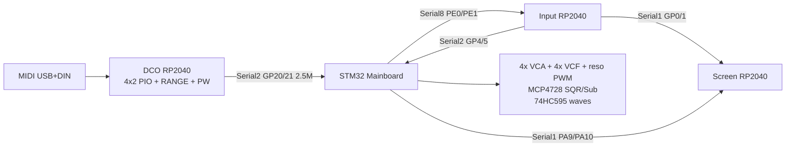

# Mainboard reintegration (DCO3 math on DCO4 wiring)

STM32 Mainboard is the analog / modulation hub again. DCO keeps MIDI + PIO pitch. Boards speak **slim little-endian** frames (no finish byte). Canonical ParamIds: DCO `params_def.h` (copied here). Do not renumber.

See also: [`SYSTEM_OVERVIEW.md`](SYSTEM_OVERVIEW.md), [`MODULATION_PIPELINE.md`](MODULATION_PIPELINE.md), DCO [`docs/MAINBOARD_REINTEGRATION.md`](../../DCO/docs/MAINBOARD_REINTEGRATION.md).

---

## Topology (classic DCO4 PCB)



| Port | Pins | Peer |
|------|------|------|
| Mainboard `Serial2` | PD6 / PD5 | DCO GP21 / GP20 |
| Mainboard `Serial8` | PE0 / PE1 | Input Serial2 GP4 / GP5 |
| Mainboard `Serial1` | PA10 / PA9 | Screen (optional second feed) |
| Input `Serial1` | GP0 / GP1 | Screen GP13 |
| DCO `Serial1` | GP0 / GP1 | DIN MIDI @ 31250 |

---

## Ownership

| Owns | Board |
|------|--------|
| MIDI, voice alloc, PIO pitch, RANGE/PW PWM, amp-comp, autotune, Character pitch/PW jitter, per-osc **pitch** drift | DCO |
| EnvVCA ×4, EnvVCF ×4, EnvDCO ×4, LFO1/LFO2, VCF drift, mod matrix, VCA/VCF/reso PWM, MCP4728, 74HC595, Input RX, DCO peer | Mainboard |
| Panel, presets, Screen UI frames | Input |
| LVGL UI | Screen |

OSC3 ParamIds (33–35, 38, 87–89) stay in the enum. Analog 4×2 has SQR1 / SQR2 / Sub only — OSC3 level dest is a no-op. Dist 52–53 is stored/stubbed.

---

## Slim LE protocol

Inner frame: `[cmd:1][payload:N]`. Little-endian. No finish byte. Optional COBS via `SERIAL_FRAMING_COBS`.

### Input → Mainboard (Serial8)

| Cmd | Payload | Meaning |
|-----|---------|---------|
| `'a'` | 8 B LE | EnvVCA A/D/S/R |
| `'b'` | 8 B | EnvVCF |
| `'c'` | 8 B | EnvDCO |
| `'d'` | 8 B | CUTOFF, RESONANCE, ADSR2→VCF, LFO2→VCF |
| `'p'` | id + i16 LE | ParamId (PW=210, ADSR1→VCA=222) |
| `'q'` | 8 ASCII | Preset name |

### DCO → Mainboard (Serial2)

| Cmd | Payload | Meaning |
|-----|---------|---------|
| `'n'` | voice, vel, note, flags | Note on. flags: bit0 retrigger ADSR, bit1 porta-only |
| `'o'` | voice | Note off (gate off only) |
| `'e'` | AT, MW, PB u16 LE | Aftertouch, mod wheel, pitch bend (matrix sources) |
| `'x'` | id + u32 LE | Gap 154 / cal 155 |
| `'p'` | id + i16 LE | Persistable / AT helpers |
| `'a'` | 8 B LE | USB/MIDI EnvVCA times (same as Input `'a'`) |
| `'b'` | 8 B | USB/MIDI EnvVCF times (same as Input `'b'`) |
| `'d'` | 8 B | USB/MIDI CUTOFF, RESONANCE, ADSR2→VCF, LFO2→VCF |

### Mainboard → DCO (Serial2)

| Cmd | Payload | Meaning |
|-----|---------|---------|
| `'m'` | 16 B LE | LFO1 Q15, LFO2 Q15, EnvDCO Q15×4, matrix pitch Q24 |
| `'t'` | 16 B | Bench ASCII: `[n:u8][n bytes]`, `n ≤ 15`, pad to 16 |
| `'p'` | id + i16 LE | DCO-owned ParamIds forwarded |

`'m'` layout (16 bytes after cmd):

```
[0..1]   LFO1Level i16 LE (Q15)
[2..3]   LFO2Level i16 LE (Q15)
[4..11]  EnvDCO_q15[0..3] i16 LE
[12..15] matrix_pitch_mod_q24 i32 LE
```

Send ~1 kHz. DCO default ignores `'m'` and runs LFO/Env/matrix locally (`ENABLE_MB_MOD_STREAM` off). Opt-in: DCO consumes `'m'` and applies local depth bakes (`LFO1_TO_DCO`, per-osc 216–218, `ADSR3_TO_DETUNE1`, `LFO2_TO_PW`, Character). Pitch drift LFOs stay on DCO either way.

### Mainboard → Input (Serial8)

| Cmd | Payload | Meaning |
|-----|---------|---------|
| `'x'` | id + u32 LE | Gap 154 (Input relays to Screen), cal 155 |
| `'p'` | id + i16 LE | Persistable mirror |

---

## Numeric domains

| Bus | Domain | Use |
|-----|--------|-----|
| Env / LFO / matrix src | Q15 | Hot `(src * scale) >> 15` |
| Pitch modifiers | Q24 | Octave-fraction; `applyDepthQ24` |
| Timer PWM / MCP | u12 0..4095 | Analog edge |

CV bakers: ADSR depths `/512`, LFO depths `/1024` + negative polarity. See DCO [`CV_MOD_SCALES.md`](../../DCO/docs/CV_MOD_SCALES.md).
