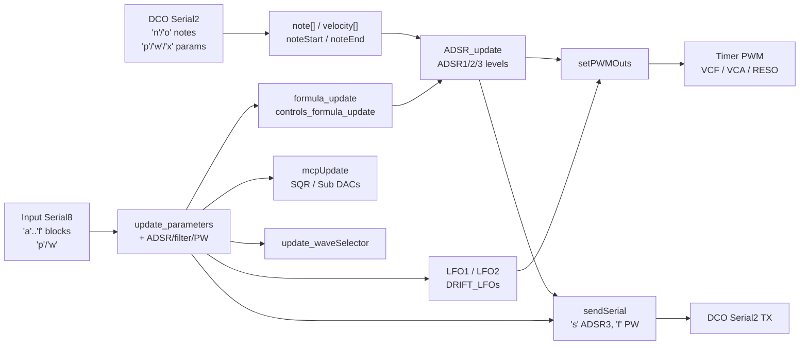

# Mainboard modulation pipeline

How notes and panel data become CVs and DCO updates on **DCO4_Mainboard_Controller**.

---

## High-level flow

---

## Soft-timer schedule (`loop`)

| Cadence | Work |
|---------|------|
| Every loop | `millisTimer`; `read_serial_2`; `LFO1`/`LFO2`; `ADSR_update`; `setPWMOuts` or manual-cal; clear `noteStart`/`noteEnd` buffers after use |
| ~223 µs | `read_serial_1` (RX stub), `read_serial_8` (Input) |
| ~1 ms | If ADSR3 enabled → request `'s'` send; if PWM pots manual → request `'f'`; `DRIFT_LFOs` |
| ~99 µs | `sendSerial()` → DCO |

---

## Notes (DCO → envelopes)

1. DCO allocates voices and sends `'n'` / `'o'` on Serial2.
2. `main_handle_note_on` / `main_handle_note_off` fill `note[]`, `velocity[]`, `noteStart[]`, `noteEnd[]`.
3. `ADSR_update()` gates noteOn/noteOff on three Bézier ADSRs per voice:
   - **ADSR1** → VCA path
   - **ADSR2** → VCF path
   - **ADSR3** → primarily forwarded to DCO (pitch/PWM on voice board); levels also sampled locally
4. Sustain parameters are refreshed ~every 5 ms in `ADSR_set_parameters()`.

---

## Input blocks (panel → locals)

| Cmd | Handler | Effect |
|-----|---------|--------|
| `'a'` | `input_handle_adsr1` | ADSR1 A/D/S/R |
| `'b'` | `input_handle_adsr2` | ADSR2 A/D/S/R |
| `'c'` | `input_handle_adsr3` | ADSR3 A/D/S/R + set send flag |
| `'d'` | `input_handle_filter_block` | CUTOFF, RESONANCE, ADSR2toVCF, LFO2toVCF + `formula_update(4)`/`(2)` |
| `'e'` | `input_handle_adsr1_to_vca` | ADSR1→VCA depth |
| `'f'` | `input_handle_pw` | Pulse width `PW` |
| `'p'`/`'w'` | param handlers | `update_parameters` |
| `'q'` | preset name | Copies 8 chars (local display/state; storage on Input) |

Param value type on this MCU: **`int32_t`**.

---

## CV math (`setPWMOuts`)

### VCA (per voice)

- Combine `ADSR1Level[i]` + optional LFO1→VCA (only if ADSR1 ≠ 0).
- Apply velocity→VCA factor.
- Map through `AS2164_VCA_linearize_table` and `linearInterpolation` into PWM range using `VCAResonanceCompensation` and `VCALevel`.
- Resonance compensation (when enabled) updates on the 1 ms flag from `RESONANCE`.

### VCF (per voice)

- `ADSR2Level[i] * ADSR2toVCF_formula` + `LFO2Level * LFO2toVCF_formula` + `CUTOFF` + `VCF_DRIFT[i]`.
- Scale by velocity→VCF and keytrack (`VCFKeytrackPerVoice`, refreshed on 1 ms when keytrack ≠ 0).
- Output inverted into timer range: `VCF_PWM[i] = 4095 - constrain(...)`.

### Resonance

- Global `RESONANCE` written to all four resonance timer channels.

Formulas for depths/speeds live in `formulas.ino` (`formula_update` / `controls_formula_update`).

---

## Back to the DCO (`sendSerial`)

Live TX paths (others are commented historical one-offs):

| When | Frame | Payload |
|------|-------|---------|
| `serialSendADSR3ControlValuesFlag` | `'s'` | ADSR3 A/D/S/R words (9 bytes) |
| `serialSendPWFlag` | `'f'` | 16-bit `PW` |
| Buffered queues | `'w'` / `'p'` | See `serialSendParamByteToDCOBuf` / `serialSendParamToDCOBuf` — **currently never filled**; real forwards use immediate `serialSendParamByteToDCOFunction` / `serialSendParamToDCOFunction` from `apply_param_*` |

Many DCO-owned params are applied locally (for UI/state) **and** forwarded in the apply function.

---

## Manual calibration

When `manualCalibrationFlag` is set (params):

- `loop` calls `setPWMOutsManualCalibration()` instead of `setPWMOuts()`.
- Forces wave mux / SQR levels for `manualCalibrationStage`, lowers VCA on the active voice, zeros resonance/cutoff for the cal path, updates mux + MCP4728.
- Related ParamIds also forward stage/offset/store to DCO / Input / Screen as needed.

---

## Inactive pieces

- **Screen RX** (`read_serial_1`): switch empty; TX helpers (`serial_send_param_change`, `'x'`/`'y'`) still used for some cal/gap reporting.
- **Local presets** (`flashData.ino`): commented out.
- **SPI DAC / Screen module / autotune**: compile flags off or includes commented.

Pin tables: [`CV_AND_PINS.md`](CV_AND_PINS.md). Semantic map: [`REFERENCE_AI.md`](REFERENCE_AI.md).
