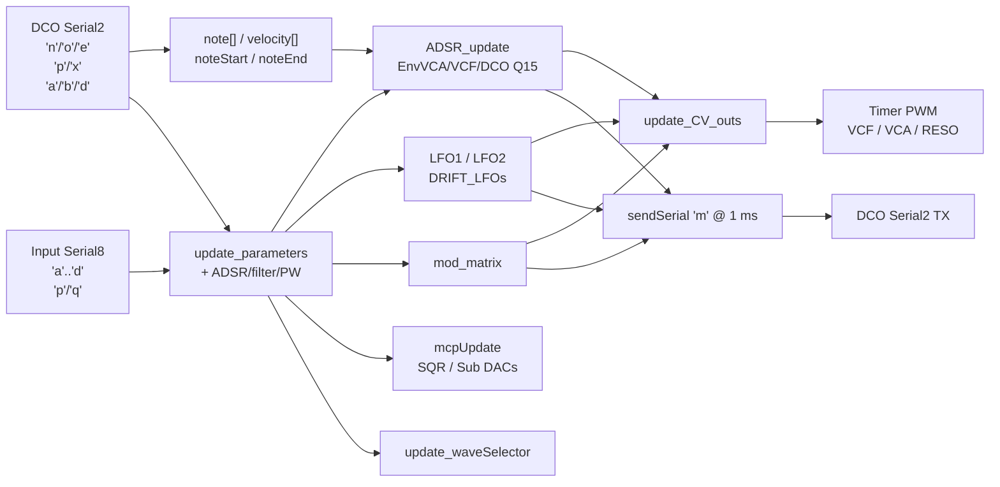

# Mainboard modulation pipeline

How notes and panel data become CVs and the DCO `'m'` stream on **DCO4_Mainboard_Controller**.

Math source: DCO3 `cv_out` / ADSR / LFO / matrix (Q15/Q24 bake-on-write). Writers stay STM32 timer PWM + MCP4728 + 74HC595.

---

## High-level flow

---

## Soft-timer schedule (`loop`)

| Cadence | Work |
|---------|------|
| Every loop | `millisTimer`; `read_serial_2`; `LFO1`/`LFO2`; `ADSR_update`; `update_CV_outs` or manual-cal |
| ~223 µs | `read_serial_1` (RX stub), `read_serial_8` (Input slim LE) |
| ~1 ms | `DRIFT_LFOs`; `sendSerial()` → `'m'` to DCO; relay `'x'`/`'p'` as needed |

---

## Notes (DCO → envelopes)

1. DCO MIDI allocator sends `'n'` / `'o'` on Serial2 (raw MIDI note + velocity + flags).
2. Flags: bit0 = retrigger envelopes, bit1 = porta-only (mono stack fallback must **not** retrigger ADSR).
3. `'o'` only when the voice actually gates off.
4. `ADSR_update()` gates noteOn/noteOff on three Q15 Bézier ADSRs per voice:
   - **EnvVCA** → analog VCA PWM
   - **EnvVCF** → analog VCF PWM (per voice)
   - **EnvDCO** → streamed to DCO on `'m'` (pitch/PW depths applied on the voice board)
5. `'e'` updates aftertouch / mod wheel / pitch bend for matrix sources 7/11.

---

## Input blocks (panel → locals)

| Cmd | Handler | Effect |
|-----|---------|--------|
| `'a'` | `input_handle_adsr1` | EnvVCA A/D/S/R |
| `'b'` | `input_handle_adsr2` | EnvVCF A/D/S/R |
| `'c'` | `input_handle_adsr3` | EnvDCO A/D/S/R |
| `'d'` | `input_handle_filter_block` | CUTOFF, RESONANCE, ADSR2→VCF, LFO2→VCF + scale bake |
| `'p'` | param handler | `update_parameters` (PW=210, ADSR1→VCA=222) |
| `'q'` | preset name | Copies 8 chars |

Param apply type: **`int16_t`** jump table. No Input `'e'`/`'f'` blocks.

---

## CV math (`update_CV_outs`)

### VCA (per voice)

- EnvVCA Q15 + optional LFO1→VCA (`/1024`, negative LFO polarity) + ADSR1→VCA (`/512`).
- Velocity→VCA factor.
- AS2164 Bézier linearize + reso→VCA lerp (`VCAResonanceCompensation`).

### VCF (per voice)

- EnvVCF Q15 × ADSR2→VCF scale + LFO2 Q15 × LFO2→VCF scale + `CUTOFF` + `VCF_DRIFT[i]` + keytrack.
- Output inverted into timer range: `VCF_PWM[i] = 4095 - constrain(...)`.

### Resonance

- Global `RESONANCE` (+ matrix dest) written to four resonance timer channels.

Scales bake on param write (`cv_bake_*`). See DCO [`docs/CV_MOD_SCALES.md`](../../DCO/docs/CV_MOD_SCALES.md).

---

## Back to the DCO (`sendSerial`)

`'m'` @ ~1 kHz, 16 bytes LE after cmd:

| Offset | Field |
|--------|-------|
| 0–1 | LFO1 Q15 |
| 2–3 | LFO2 Q15 |
| 4–11 | EnvDCO Q15 ×4 |
| 12–15 | matrix pitch Q24 |

DCO applies streamed Q15 with **local depth bakes** (`LFO1_TO_DCO`, per-osc 216–218, `ADSR3_TO_DETUNE1`, `LFO2_TO_PW`, Character). Pitch drift stays on DCO.

DCO-owned ParamIds forward immediately via slim `'p'`. Gap 154 / cal 155 from DCO `'x'` relay to Input (and 154 optionally to Screen).

---

## Manual calibration

When `manualCalibrationFlag` is set:

- `loop` calls `update_CV_outs_manual_calibration()` instead of `update_CV_outs()`.
- Mutes mux / parks VCA / forces SQR levels for `manualCalibrationStage`.
- Related ParamIds forward stage/offset/store to DCO.

---

## Inactive pieces

- **Screen RX** (`read_serial_1`): drain-only stub.
- **Local presets** (`flashData.ino`): commented out.
- **SPI DAC / Screen module / autotune**: flags off.
- **Float-era `formulas.ino` / `setPWMOuts` / `'s'`/`'f'` streams:** retired.

Pin tables: [`CV_AND_PINS.md`](CV_AND_PINS.md). Semantic map: [`REFERENCE_AI.md`](REFERENCE_AI.md).
