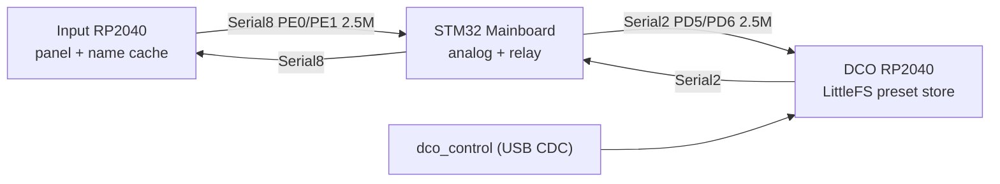
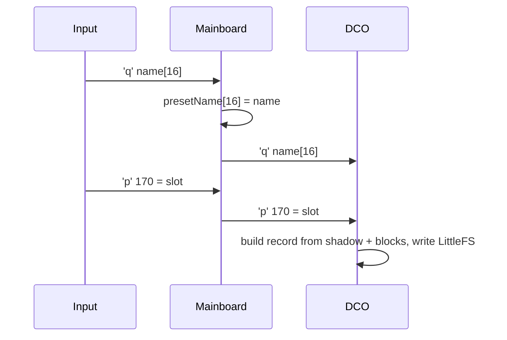
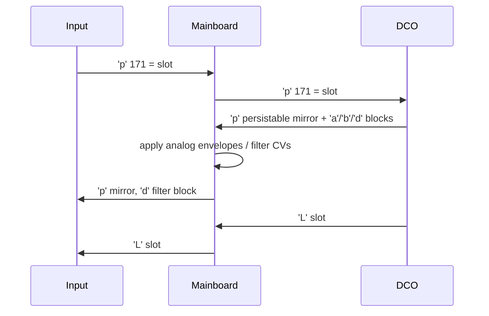
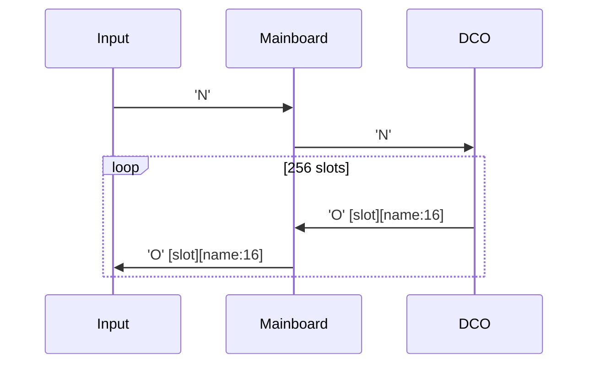

# Preset relay (Input ↔ DCO through the Mainboard)

The Mainboard stores **no presets**. It sits physically between the panel and the
preset store, so it has to carry preset traffic across itself, one registered
command byte at a time.

- Store owner / record format: DCO [`PRESET_STORE.md`](../../DCO/docs/PRESET_STORE.md)
- Panel side: Input [`PRESETS.md`](../../INPUT-CONTROLLER/docs/PRESETS.md)
- Wire contract: [`MAINBOARD_REINTEGRATION.md`](MAINBOARD_REINTEGRATION.md)
- Serial / ParamId how-to: [`README_serial_and_params.md`](README_serial_and_params.md)
- Handlers and tables: [`FILE_INDEX.md`](FILE_INDEX.md) → `Serial.ino`

---

## Ownership

| Board | Preset role |
|-------|-------------|
| DCO | 256-slot LittleFS store (`pb00`..`pb63`), single source of truth for the instrument; builds each record from its own in-RAM parameter state |
| Input | RAM-only cache of the 256 slot **names** (`presetDir[256][16]`); no filesystem |
| Mainboard | None. `presetName[16]` in `params.h` is a display/echo copy of the last `'q'` frame |
| Screen | None |

Preset storage used to live on the Input board. It does not anymore, and nothing
in this firmware persists a patch — `flashData.*` is gone, and `ENABLE_SD` only
reserves the SDMMC pins so `init_timers()` skips the conflicting timer channel.

---

## Why a relay exists

There is no wire between Input and the DCO on this instrument:

On DCO3-MONOSYNTH the Input board talks to the DCO directly and the same frames
need no carrier. Both instruments share the Input firmware source tree (one line
in `board_model.h` selects the model), so the Input side of this link is not
DCO4-specific code — everything model-specific about preset traffic on DCO4 is
the relay implemented here.

---

## Relayed command bytes

`Serial.ino` has **no generic pass-through**. Each direction is a separate
handler registered in a separate LUT, so a byte with no entry is dropped by
`serial_parser_dispatch()` without a trace.

| Cmd | Payload | Direction | Handler | Registered in |
|-----|--------:|-----------|---------|---------------|
| `'q'` | 16 | Input → DCO | `input_handle_preset_name` | `inputSerial8Commands[]` |
| `'N'` | 1 | Input → DCO | `input_handle_preset_dir_request` | `inputSerial8Commands[]` |
| `'O'` | 17 | DCO → Input | `main_handle_preset_dir_entry` | `mainSerial2Commands[]` |
| `'L'` | 1 | DCO → Input | `main_handle_preset_loaded` | `mainSerial2Commands[]` |
| `'a'` / `'b'` / `'c'` / `'d'` | 8 | Input → DCO (also applied locally) | `input8_handle_adsr1/2/3`, `input8_handle_filter_block` | `inputSerial8Commands[]` |
| `'p'` 170–173 | 3 | Input → DCO | `apply_param_preset_save/_load/_dump`, `apply_param_cal_dump` | `paramTable[]` (`params.ino`) |

`'q'` is also kept locally: `input_handle_preset_name` copies all 16 bytes into
`presetName[]` before forwarding. `'N'` carries one unused padding byte because
`serial_parser_dispatch()` treats `payload_len == 0` as "unregistered command",
so a true zero-length frame could never dispatch.

ParamIds 170–173 are ordinary `'p'` frames, so they arrive through
`input_handle_param16` → `update_parameters` like any other parameter; the
appliers are one-liners that call `forward_dco()` and keep no state.

| ParamId | Name | Meaning on the DCO |
|--------:|------|--------------------|
| 170 | `PARAM_PRESET_SAVE` | Snapshot live state into slot `value` |
| 171 | `PARAM_PRESET_LOAD` | Recall slot `value` |
| 172 | `PARAM_PRESET_DUMP` | −1 = directory text, 0..255 = slot hex (USB CDC answer) |
| 173 | `PARAM_CAL_DUMP` | Calibration table dump (USB CDC answer) |

### Not relayed

`'B'` (bulk chunk, 36 B) and `'C'` (bulk commit, 8 B) are declared in the shared
`serial_input_protocol.h` but are **host → DCO over USB CDC only**; `dco_control`
speaks to the DCO directly and never crosses this board. `'B'` also exceeds
`SERIAL_INNER_MAX_PAYLOAD` here, so relaying it would need that raised to 36.

---

## Panel blocks are shadowed, not just applied

The Mainboard owns the analog envelopes and the filter, so it consumes `'a'`–`'d'`
itself. The DCO builds a preset record out of **its own** copies of those same
values and has no direct panel link, so an Input-origin block has to be applied
here *and* passed on — otherwise a saved preset captures stale envelope and
filter settings.

That is the only job of the `input8_*` wrappers: each calls the plain local
handler (analog behaviour unchanged) and then `mb_forward_block_to_dco()`.

Only the Serial8 side forwards to the DCO. The identical `'a'`/`'b'`/`'d'` frames
registered in `mainSerial2Commands[]` come from the DCO itself (USB/MIDI edits,
preset recalls), so nothing goes back to the DCO. `'c'` is not registered on
Serial2 at all — EnvDCO from the DCO side stays DCO-local.

`'d'` is the one block that also travels DCO→Input, so that a preset recall moves
the panel's filter pots. That mirror lives in `main_handle_filter_block()`, the
Serial2-only wrapper, **not** in the shared `input_handle_filter_block()` apply
function — keeping it out of the shared function is what stops an Input-origin
filter edit from being echoed straight back to its sender. If Serial8 has no room
the frame is parked in `mb_filter_forward_ring` (8 deep) and drained around the
next Serial2 parse.

The two directions are deliberately asymmetric, and the pattern generalises: put
the **apply** logic in a plain handler, and put each **forward** in the wrapper
registered on the link the frame arrived from.

---

## Flows

### Save

Panel edits to ADSR / filter must have reached the DCO *before* the save, which
is exactly what the `input8_*` wrappers guarantee.

### Load

`'L'` also fires for loads Input did not trigger — boot recall, MIDI Program
Change, `dco_control` — which is why it has to cross this board.

### Directory

A directory push is 256 back-to-back 17-byte frames, sent on Input boot and on
entering browse mode — never on a per-encoder-tick path. `'O'` and `'L'` are
written straight out instead of through `mb_filter_forward_ring`: dropping one
`'O'` would leave a wrong name in Input's cache. Both links run at 2.5 Mbaud, so
the Mainboard forwards at the rate it receives and the 512-byte TX buffer
(`build_opt.h`) absorbs the jitter.

---

## Payload budget

`Serial.h` sets `SERIAL_INNER_MAX_PAYLOAD` to **17** before `serial_frame.h` locks
its default, purely for `'O'`. Everything else the Mainboard touches tops out at
16 (`'m'` / `'t'`). At 16 the relay would break silently in both directions: the
parser drops the 17th byte and then dispatches nothing (`received_len !=
expected_len`), and `serial_frame_stuff()` refuses to write an over-long payload.

---

## Adding a new preset / DCO-bound command

A new byte is dropped between Input and the DCO unless it is registered **here**
as well as on both endpoints.

1. Add the command and its `INPUT_SERIAL_LEN_*` to the canonical
   `serial_input_protocol.h` (master copy:
   `DCO3-MONOSYNTH/DCO/serial_input_protocol.h`) and copy it to every board.
2. If the payload is longer than 17 bytes, raise `SERIAL_INNER_MAX_PAYLOAD` in
   `Serial.h` on this board **and** on both endpoints.
3. Write a handler in `Serial.ino` that calls `serial_frame_write()` on the far
   port, guarded by the matching `ENABLE_SERIAL2` / `ENABLE_SERIAL8`.
4. Register it in `inputSerial8Commands[]` (Input → DCO) or
   `mainSerial2Commands[]` (DCO → Input).
5. If it is a `'p'` ParamId instead of a command byte, add an applier that calls
   `forward_dco()` and register it in `paramTable[]` in `params.ino`.

The same rule applies in reverse: removing an entry from those tables silently
severs the path rather than producing a build error.
